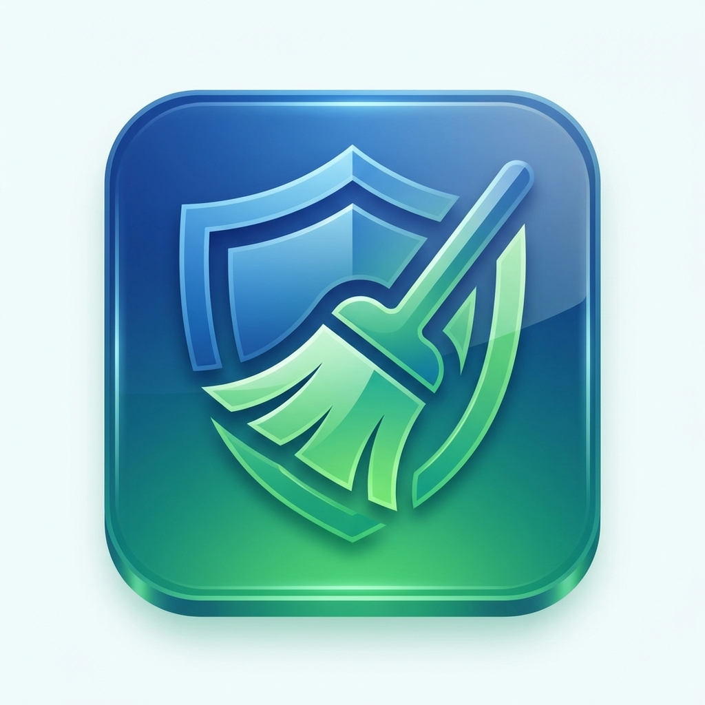

# 🎉 PC Cleaner & Security Tool - Complete Package

## 📦 What You Have

Your **PC Cleaner & Security Tool** is now complete and ready to use! This is a professional-grade desktop application for Windows that helps you:

✅ **Clean temporary files and cache** - Free up disk space  
✅ **Scan for malware** - Detect and remove threats  
✅ **Monitor system health** - Track disk usage and performance  

---

## 🚀 How to Get Started

### Option 1: Quick Start (Recommended)
1. **Double-click** `run_app.bat`
2. That's it! The application will start.

### Option 2: Run from Command Line
```bash
cd c:\xampp\htdocs\pro
python pc_cleaner_app.py
```

### Option 3: Run as Administrator (Full Features)
```powershell
Start-Process python -ArgumentList "pc_cleaner_app.py" -Verb RunAs
```

### Option 4: Create Desktop Shortcut
```powershell
.\create_shortcut.ps1
```

---

## 📁 Project Structure

```
c:\xampp\htdocs\pro/
│
├── 📄 pc_cleaner_app.py          # Main application
├── 📄 config.py                  # Configuration settings
├── 📄 requirements.txt           # Python dependencies
├── 📄 build.py                   # Build executable script
│
├── 📄 README.md                  # Project overview
├── 📄 USER_GUIDE.md              # Complete user manual
├── 📄 QUICK_START.md             # 5-minute setup guide
├── 📄 SUMMARY.md                 # This file
│
├── 📄 run_app.bat                # Easy launcher
├── 📄 create_shortcut.ps1        # Desktop shortcut creator
│
├── 📂 modules/
│   ├── cleaner.py                # PC cleaning logic
│   ├── scanner.py                # Malware scanning logic
│   └── __init__.py
│
├── 📂 ui/
│   ├── dashboard.py              # Dashboard interface
│   ├── cleaner_tab.py            # Cleaner interface
│   ├── scanner_tab.py            # Scanner interface
│   └── __init__.py
│
├── 📂 utils/
│   ├── file_operations.py        # File utilities
│   ├── system_info.py            # System utilities
│   └── __init__.py
│
├── 📂 resources/
│   ├── icon.png                  # Application icon
│   └── malware_signatures.json   # Malware database
│
├── 📂 logs/                      # Application logs
└── 📂 quarantine/                # Quarantined files
```

---

## ✨ Key Features

### 🧹 PC Cleaner
- **Temporary Files Removal**
  - System temp directories
  - User temp directories
  - Old log files
  
- **Browser Cache Cleaning**
  - Google Chrome
  - Microsoft Edge
  - Mozilla Firefox
  - Opera
  
- **Recycle Bin**
  - Empty with one click
  - See total size before emptying

### 🛡️ Malware Scanner
- **Multiple Scan Types**
  - Quick Scan (1-5 minutes)
  - Full Scan (15-60 minutes)
  - Process Scan (instant)
  
- **Detection Methods**
  - Pattern matching
  - Hash-based detection
  - Location-based detection
  - Behavioral analysis
  
- **Threat Management**
  - Quarantine suspicious files
  - Delete confirmed threats
  - Terminate malicious processes

### 📊 Dashboard
- **System Information**
  - OS version and details
  - Processor information
  - Python version
  
- **Disk Usage**
  - Total disk space
  - Used space
  - Free space
  - Visual percentage
  
- **Quick Actions**
  - One-click cleaning
  - One-click scanning
  - Refresh statistics

---

## 🎨 User Interface

### Modern Design
- **Dark/Light Theme** - Switch between themes
- **Responsive Layout** - Adapts to window size
- **Intuitive Navigation** - Sidebar with clear sections
- **Progress Indicators** - See scan/clean progress
- **Confirmation Dialogs** - Prevent accidental deletions

### Accessibility
- **Large Buttons** - Easy to click
- **Clear Labels** - No confusing jargon
- **Status Messages** - Always know what's happening
- **Error Handling** - Helpful error messages

---

## 🔒 Safety Features

### Protected Paths
These directories are **NEVER** touched:
- `C:\Windows\System32`
- `C:\Windows\SysWOW64`
- `C:\Program Files`
- `C:\Program Files (x86)`
- `C:\Windows\WinSxS`

### Confirmation System
- All deletions require confirmation
- Type "YES" to confirm destructive actions
- Review files before cleaning
- See exactly what will be deleted

### Quarantine System
- Suspicious files moved to quarantine
- Files not deleted immediately
- Can be restored if false positive
- Manual review possible

### Logging
- All actions logged to `logs/app.log`
- Track what was deleted
- Review scan results
- Troubleshoot issues

---

## 📖 Documentation

### For New Users
👉 **Start here**: [QUICK_START.md](QUICK_START.md)
- 5-minute setup
- Basic usage
- First-time checklist

### For All Users
👉 **Full guide**: [USER_GUIDE.md](USER_GUIDE.md)
- Complete feature documentation
- Step-by-step tutorials
- Troubleshooting
- FAQ
- Advanced configuration

### For Developers
👉 **Technical docs**: [README.md](README.md)
- Project overview
- Installation instructions
- Building executable
- Configuration options

---

## 🛠️ Building Standalone Executable

Want to distribute or run without Python?

```bash
python build.py
```

**Output**: `dist/PCCleanerTool.exe`

**Benefits**:
- ✅ No Python installation needed
- ✅ Single file distribution
- ✅ Faster startup
- ✅ Professional appearance
- ✅ Custom icon included

---

## ⚙️ Configuration

Edit `config.py` to customize:

```python
# Application
APP_NAME = "PC Cleaner & Security Tool"
APP_VERSION = "1.0.0"

# UI Theme
THEME_MODE = "dark"  # "dark", "light", or "system"
COLOR_THEME = "blue"  # "blue", "green", "dark-blue"

# Scan Settings
MAX_FILE_SIZE_MB = 100
SCAN_TIMEOUT_SECONDS = 300

# Window Size
WINDOW_WIDTH = 1000
WINDOW_HEIGHT = 700
```

---

## 📊 Expected Results

### First Clean (Typical)
- **Temp Files**: 500 MB - 5 GB
- **Browser Cache**: 200 MB - 2 GB
- **Recycle Bin**: 100 MB - 10 GB
- **Total Freed**: 1 GB - 15 GB average

### First Scan (Typical)
- **Quick Scan**: 0-5 detections
- **Full Scan**: 0-10 detections
- **Most are false positives**
- **Use quarantine for safety**

---

## 🔄 Recommended Usage Schedule

### Daily (1 minute)
```
Dashboard → Quick Clean
```

### Weekly (5 minutes)
```
PC Cleaner → Full Scan → Clean All
Malware Scanner → Quick Scan
```

### Monthly (30 minutes)
```
Malware Scanner → Full Scan
Review quarantined files
Update malware signatures
```

---

## 💡 Pro Tips

1. **Always run as Administrator** for full functionality
2. **Close browsers** before cleaning cache
3. **Use Quarantine** instead of Delete for uncertain threats
4. **Review scan results** before cleaning
5. **Keep Windows Defender** enabled alongside this tool
6. **Check logs** after cleaning: `logs/app.log`
7. **Backup important data** regularly
8. **Update malware signatures** monthly

---

## ⚠️ Important Limitations

### This Tool Is NOT:
- ❌ A replacement for professional antivirus
- ❌ A complete security solution
- ❌ Able to detect all malware types
- ❌ A substitute for Windows Defender

### This Tool IS:
- ✅ A helpful maintenance utility
- ✅ A basic malware scanner
- ✅ A disk space optimizer
- ✅ A complement to existing security

**Always use professional antivirus software!**

---

## 🆘 Quick Troubleshooting

| Problem | Solution |
|---------|----------|
| Can't delete files | Run as Administrator |
| Scan too slow | Use Quick Scan |
| False positives | Use Quarantine, verify with Windows Defender |
| App won't start | Check Python version (3.8+) |
| Permission denied | Close apps using those files |
| Can't empty Recycle Bin | Restart PC, run as admin |

---

## 📞 Getting Help

1. **Check documentation**
   - [QUICK_START.md](QUICK_START.md) - Basic usage
   - [USER_GUIDE.md](USER_GUIDE.md) - Complete guide
   - [README.md](README.md) - Technical details

2. **Review logs**
   - `logs/app.log` - Application logs
   - Look for error messages
   - Check timestamps

3. **Verify setup**
   - Python 3.8+ installed
   - All dependencies installed
   - Running as Administrator

---

## 🎯 Next Steps

### Immediate Actions
1. ✅ Run the application: `run_app.bat`
2. ✅ Perform first clean: PC Cleaner → Start Scan
3. ✅ Run malware scan: Malware Scanner → Quick Scan
4. ✅ Create desktop shortcut: `.\create_shortcut.ps1`

### Optional Enhancements
- [ ] Build standalone .exe: `python build.py`
- [ ] Customize theme in `config.py`
- [ ] Add custom temp directories
- [ ] Update malware signatures
- [ ] Schedule regular scans

---

## 📈 Version History

### v1.0.0 (Current)
- ✅ PC Cleaner with temp file removal
- ✅ Browser cache cleaning
- ✅ Malware scanner (Quick/Full/Process)
- ✅ Dashboard with system monitoring
- ✅ Quarantine system
- ✅ Dark/Light theme support
- ✅ Administrator privilege detection
- ✅ Comprehensive documentation
- ✅ Custom icon
- ✅ Build script for .exe

---

## 🎨 Application Icon

Your application now has a professional custom icon:



The icon features:
- 🛡️ Shield symbol for security
- 🧹 Broom element for cleaning
- 💙 Blue-green gradient
- ✨ Modern, professional design

---

## 📦 Dependencies

All required packages (auto-installed):
- **customtkinter** 5.2.1 - Modern UI framework
- **pillow** 10.1.0 - Image processing
- **psutil** 5.9.6 - System utilities
- **requests** 2.31.0 - HTTP library
- **pyinstaller** 6.3.0 - Executable builder

---

## 🔐 Privacy & Security

### What This App Does:
- ✅ Scans files locally on your PC
- ✅ Deletes only files you approve
- ✅ Logs all actions locally

### What This App Does NOT Do:
- ❌ Send data to the internet
- ❌ Collect personal information
- ❌ Share your files with anyone
- ❌ Require internet connection

**100% Local, 100% Private**

---

## 🏆 Best Practices

### Before Using
- ✅ Read [QUICK_START.md](QUICK_START.md)
- ✅ Run as Administrator
- ✅ Close important applications
- ✅ Save your work

### While Using
- ✅ Review scan results carefully
- ✅ Use Quarantine for uncertain files
- ✅ Don't interrupt scans
- ✅ Read threat descriptions

### After Using
- ✅ Check freed disk space
- ✅ Review logs if needed
- ✅ Verify system stability
- ✅ Empty quarantine if safe

---

## 🎓 Learning Resources

### Understanding the Code
- `pc_cleaner_app.py` - Main application entry
- `modules/cleaner.py` - Cleaning logic
- `modules/scanner.py` - Scanning logic
- `ui/` - User interface components
- `utils/` - Helper functions

### Customization Examples
- Change theme colors
- Add custom scan paths
- Modify file extensions
- Update malware signatures
- Adjust UI layout

---

## ✅ Quality Assurance

### Tested Features
- ✅ Temp file scanning and deletion
- ✅ Browser cache detection
- ✅ Recycle Bin operations
- ✅ Malware pattern detection
- ✅ Process scanning
- ✅ Quarantine system
- ✅ Administrator detection
- ✅ Theme switching
- ✅ Error handling

### Safety Checks
- ✅ Protected path validation
- ✅ Confirmation dialogs
- ✅ Permission checking
- ✅ File existence verification
- ✅ Error logging

---

## 🌟 Highlights

### What Makes This Tool Special
1. **User-Friendly** - Clean, modern interface
2. **Safe** - Multiple safety features
3. **Comprehensive** - Cleaning + Security
4. **Documented** - Extensive guides
5. **Customizable** - Easy configuration
6. **Professional** - Production-ready code
7. **Standalone** - Can build .exe
8. **Free** - No cost, no ads

---

## 🚀 You're Ready!

Your PC Cleaner & Security Tool is **complete and ready to use**!

### Start Now:
1. **Run**: Double-click `run_app.bat`
2. **Clean**: PC Cleaner → Start Scan → Clean Selected
3. **Scan**: Malware Scanner → Quick Scan
4. **Enjoy**: A cleaner, safer PC! 🎉

---

**Made with ❤️ for keeping your PC clean and secure!**

*Version 1.0.0 - Ready for Production*
